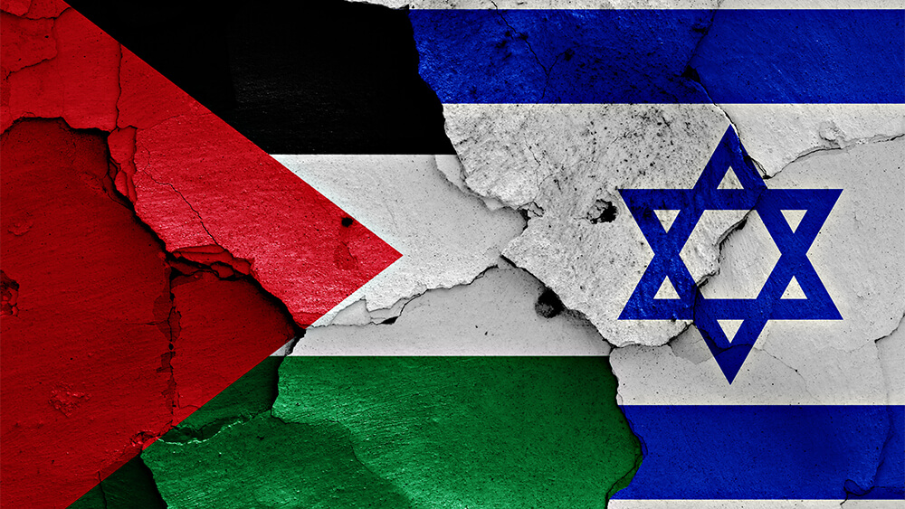
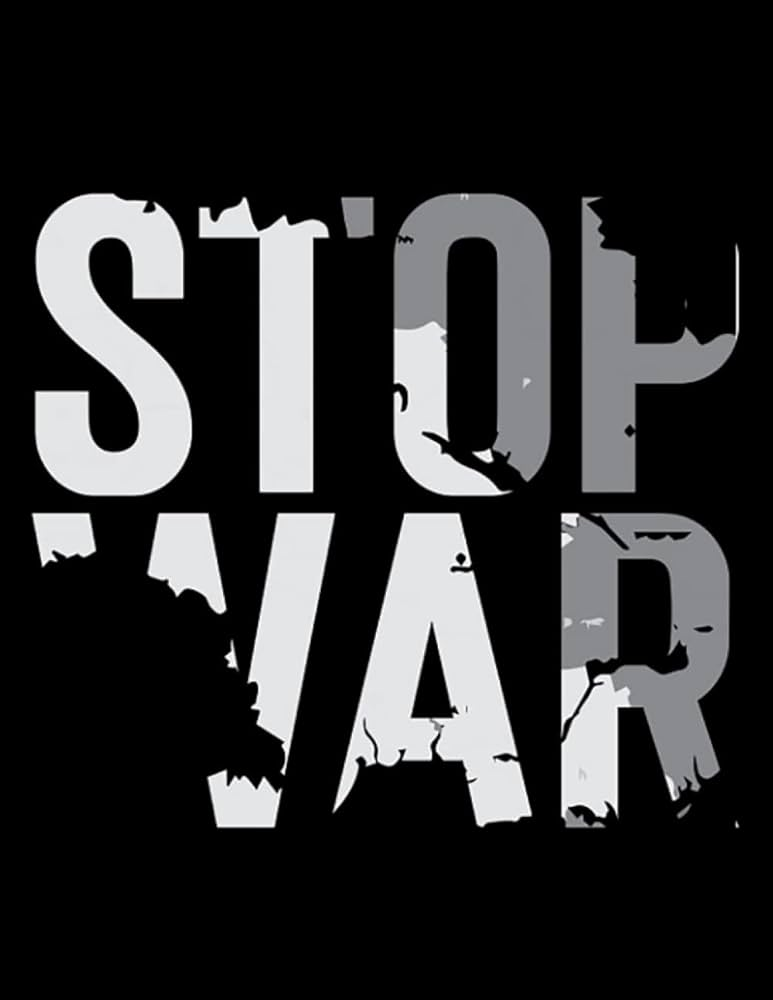

# Conflicto Palestina

## Inicio del conlficto



1. **Contexto histórico**
    - **Mandato Británico de Palestina**: Tras la *Primera Guerra Mundial*, la región de Palestina quedó bajo ***control británico***.
    - **Inmigración judía**: Aumentó tras el *Holocausto* y la persecución en Europa generó tensiones. 
2. **Temas clave del conflicto**
   - **Territorio**: Disputa sobre *Gaza* y *Jerusalén Este*.
   - **Seguridad**: Preocupaciones de *Israel* por ataques de grupos como ***Hamás***.
 3.  **Situación actual**
     - **Tensiones**, violencia y bloqueos en ***Gaza***.
     

***FIN***

```
Borja de Saá.
```